# DayBreak

**A fully customisable sunrise alarm clock for Home Assistant.**

> [!WARNING]
> **This project is AI-generated ("vibe coding").**
> Almost all of the code, tests and documentation were written by an AI (Claude). The maintainer describes what DayBreak should do, then tests the result in a test instance and on a real Home Assistant. Not every line has been reviewed by an experienced developer.
>
> - Use DayBreak at your own risk and make a **backup** before you install or update it.
> - **Do not rely on DayBreak as your only alarm** for anything important (flights, exams, medication). Keep a second alarm, e.g. on your phone.
> - DayBreak controls real devices: lights, speakers, heating and air conditioning. Check your settings, especially for climate devices.
> - Bug reports are very welcome in the [issue tracker](https://github.com/sempai-san/ha-daybreak/issues).

DayBreak wakes you up gently: your lights fade in like a sunrise before the alarm time, music gets louder, and the bedroom is already warm. You manage alarms in a dedicated sidebar panel and control them from dashboard cards. Every alarm is also available to automations as entities, events and actions.

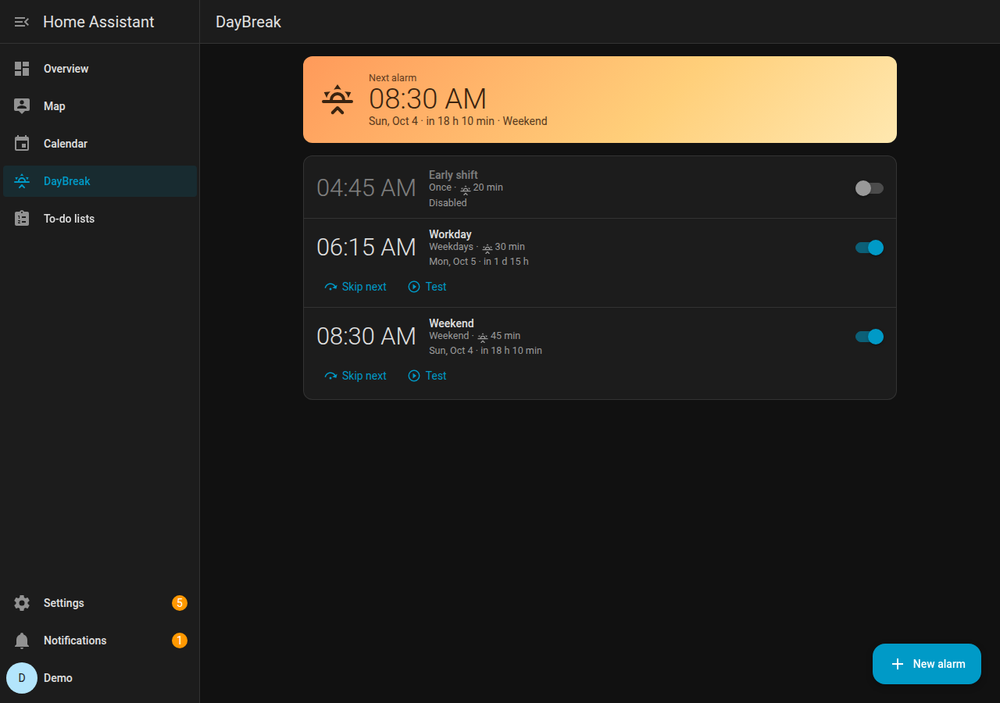

## Contents

- [Features](#features)
- [Screenshots](#screenshots)
- [Installation](#installation)
- [First steps](#first-steps)
- [Calendar rules](#calendar-rules)
- [Test run and history](#test-run-and-history)
- [Dashboard cards](#dashboard-cards)
- [Entities, actions and events](#entities)
- [Updating](#updating)
- [Troubleshooting](#troubleshooting)
- [Development](#development)

## Features

**Alarms and times**
- Three kinds: **wake-up light** (sunrise before the alarm), **sleep light** (fades out while you fall asleep) and **OK-to-wake light** for kids (red = stay in bed, green = get up)
- Fixed time, or **follow the sun**: sunrise/sunset or civil, nautical or astronomical twilight, with an offset and earliest/latest limits
- Repeat on weekdays (also every 2nd/3rd/4th week), every X days/weeks, a free **shift pattern**, or once
- **Only once different** (e.g. tomorrow earlier) without touching the normal schedule
- **Public holidays** are skipped via the Workday integration (normal free days are not treated as holidays)
- Owners per alarm; presence check (skip when nobody is home, stop when everybody leaves) only when you pick presence entities

**Calendar**
- Rules per alarm: *if an event in these calendars contains these keywords, then …*
  - **no alarm** (e.g. "Vacation")
  - **another time** (e.g. "Early shift" → 05:00)
  - **X minutes before the event**, optionally **plus the travel time** to the event's location (Waze, with live traffic shortly before)
  - **another alarm rings instead** (e.g. on a "Home office" day your weekend alarm rings)
- Rules can also ring on days the alarm is not set for (e.g. a Saturday shift)
- Rules are checked from top to bottom, the first matching rule decides; a preview shows what happens in the next days

**Wake earlier automatically**
- Weather (snow/ice, storm incl. official warnings such as DWD, heavy rain, cold) and **travel time** from a sensor (e.g. Waze, with "arrive by" and your morning routine)
- Several rules: take the strongest one or add them up, always capped by a maximum
- Rules are checked again while the sunrise is running: the light start moves along, or a running sunrise gets shorter without jumping

**Light**
- Lights, groups, areas, devices or labels; settings shared by all lamps or **per lamp**
- **Start per lamp**: every lamp gets its own row on the time line and can start later; it still reaches its target at the alarm time
- Four ready-made curves or your own **draggable curve**, one curve for everything or separate curves for brightness and colour
- **Colour temperature or colour** (sunrise, dawn, pastel or your own colour sequence); white-only lamps follow a matching colour temperature
- **Light profiles** (templates and your own). Profiles used by alarms of different people are locked; changes are saved as a new profile
- Pulse or blink while ringing (accessibility), switch off after stopping or 30 min later, spare lamp if a lamp is unreachable

**Snooze and "if nobody reacts"**
- Snooze options (e.g. 5/9/15 min) are defined once in the settings and chosen per alarm
- After N snoozes the **last call** starts: a profile with all lights on and any actions, for a limited time only; otherwise the alarm stops by itself
- Turning a lamp off by hand stops the alarm (optional)

**Audio and phone**
- Music Assistant (playlist, radio, album, track, with search in the editor), a sound URL and a spoken announcement (text-to-speech template, e.g. time and temperature)
- Music starts a few minutes before the alarm, quietly, and gets louder along a curve you can shape with points; it pauses while snoozing and the old volume is restored afterwards
- **Speaker button**: pause on the speaker (e.g. tapping a HomePod) snoozes, during the last call it stops the alarm
- **Phone notifications with Snooze and Stop** to the owners' Home Assistant apps (found automatically) and other devices; the last call can be a **critical alert** that rings even in Do Not Disturb

**Climate**
- Thermostats and air conditioners (heat, cool, heat/cool, auto, dry, fan), fans, humidifiers and dehumidifiers, water heaters and plain switches (e.g. an electric blanket)
- Start a fixed time before the alarm, or **learned**: DayBreak measures how fast the room warms up or cools down and starts just in time (planned with the weather forecast, adjusted with the current temperature shortly before)
- Only when needed, only when somebody is home, only when it is colder/warmer outside than a limit; pauses while a window is open
- After waking up: back to the previous state, switch off, or keep running while somebody is home
- **Climate profiles** shared by several alarms, or own settings per alarm

**Testing and troubleshooting**
- **Test run in time lapse** right in the editor (light and audio sections): e.g. one minute takes 10 seconds, also for snooze, the last call and the music ramp; works with unsaved settings, shows a simulated clock and problems such as a speaker that could not play
- **History** of every alarm (rang, skipped, planned, test runs), coloured by outcome; pick one to see a time bar and a step-by-step flow from the weather/travel/calendar/climate checks to the end, with plain-language hints for problems

**More**
- Actions at light start, alarm, snooze and stop (any Home Assistant action)
- Notifications (e.g. alarm moved, lamp not reachable) and Home Assistant notifications for problems
- **Simple / Advanced / Expert** editor that works on phone, tablet and desktop. In the settings you choose which options Simple and Advanced show; Expert always shows everything
- Import/export of alarms and profiles
- Dashboard cards in Home Assistant style, optionally Mushroom or Bubble look
- English and German UI

## Screenshots

| Alarm editor | Calendar rules |
| --- | --- |
| 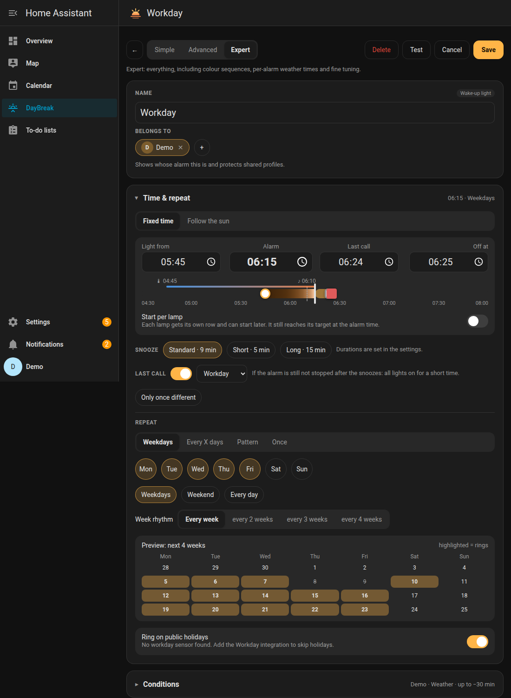 | 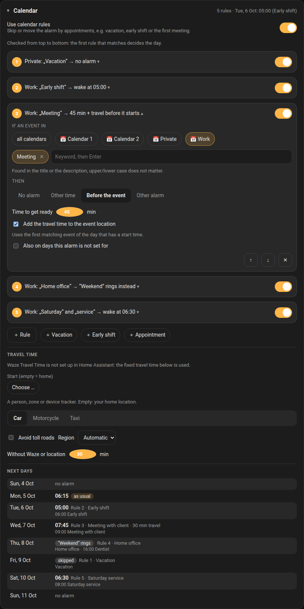 |

| Light | Audio |
| --- | --- |
| 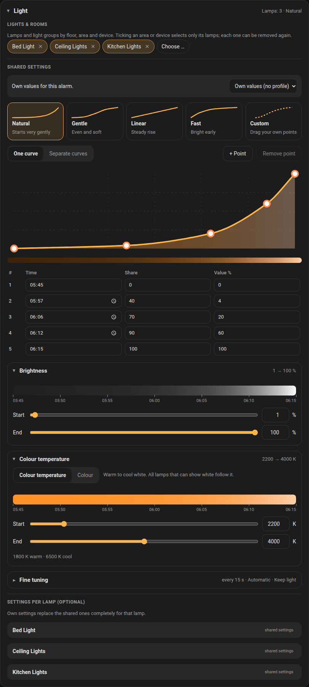 | 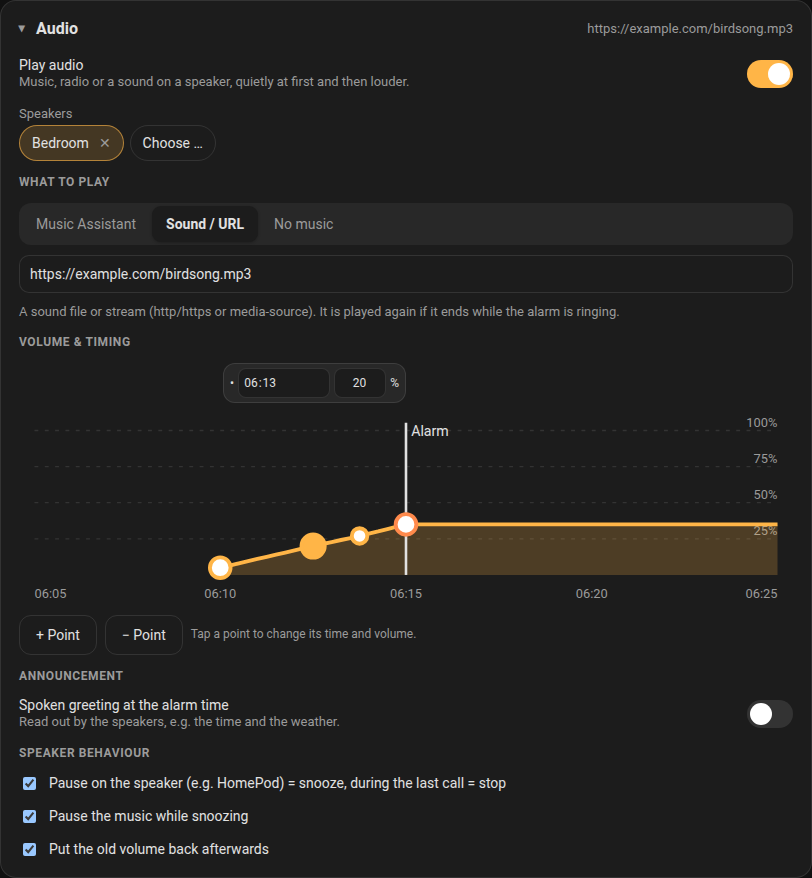 |

| Climate | Light profiles |
| --- | --- |
| 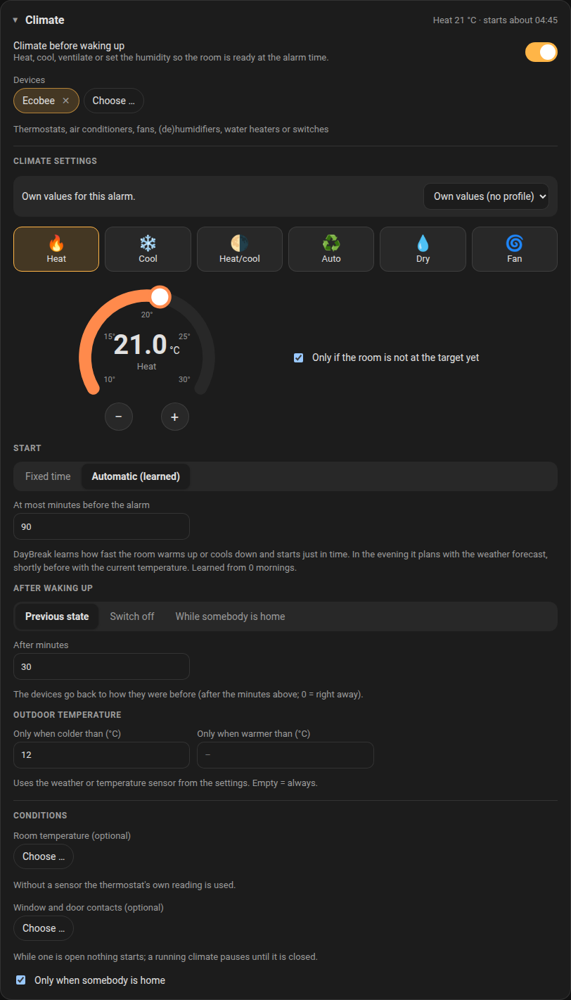 | 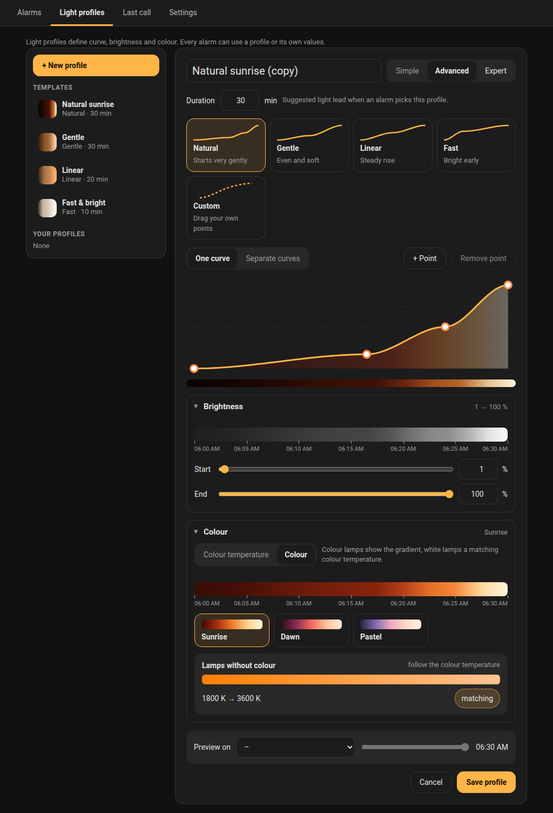 |

| Test run | History |
| --- | --- |
| 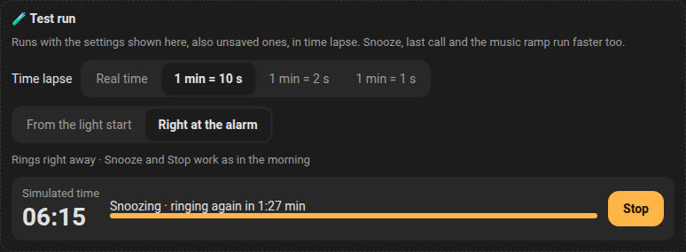 | 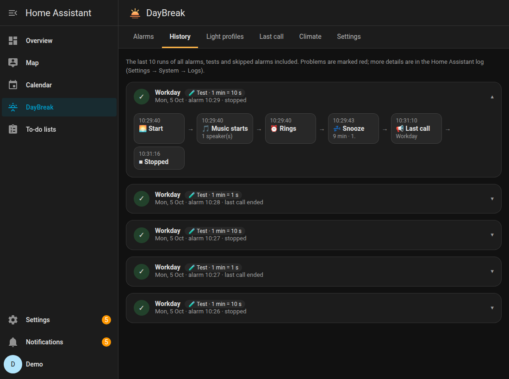 |

| Settings | Phone |
| --- | --- |
| 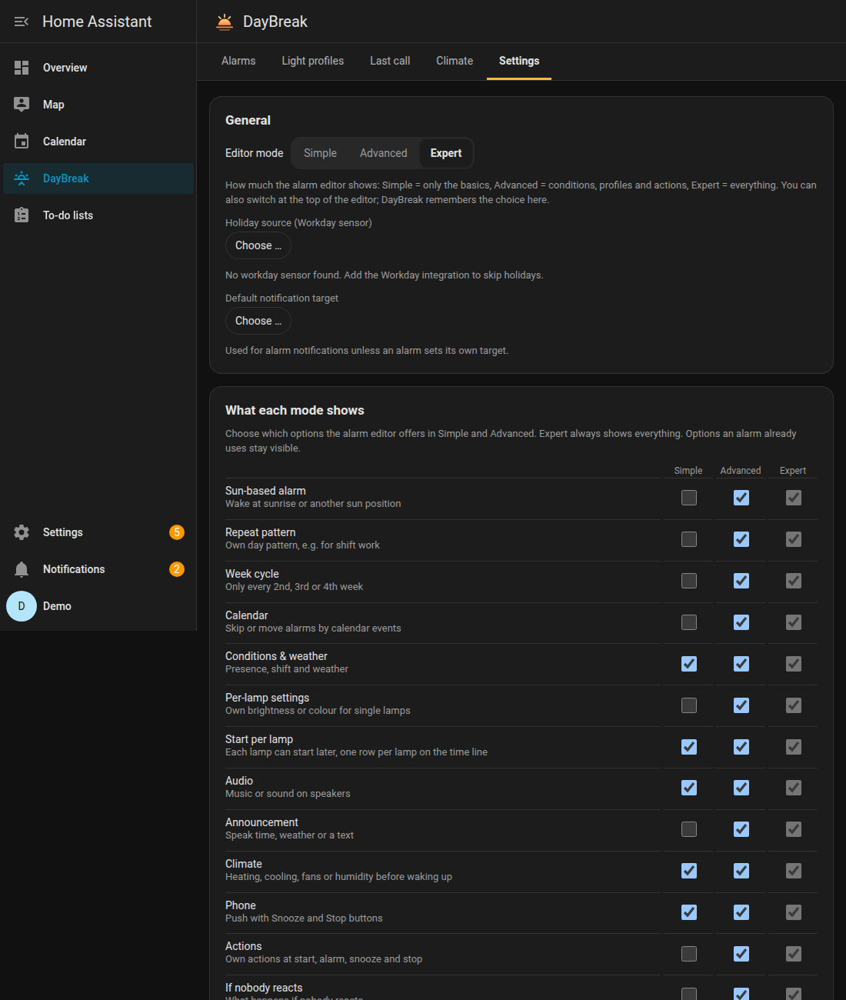 | 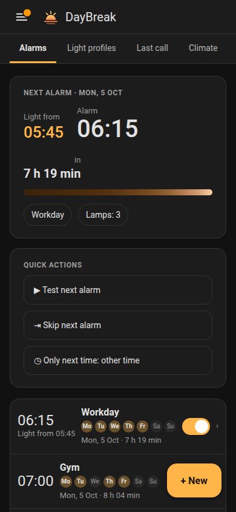 |

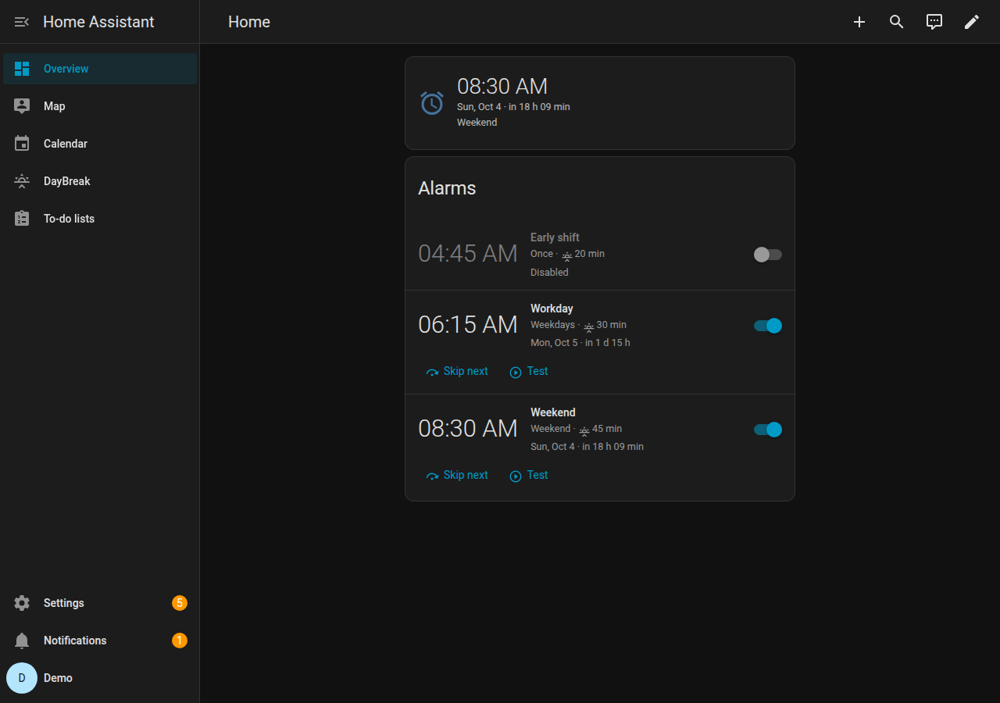

## Installation

Requires Home Assistant **2026.2** or newer.

### HACS (custom repository)

1. In HACS, open the menu (⋮) → **Custom repositories**.
2. Add `https://github.com/sempai-san/ha-daybreak` with type **Integration**.
3. Install **DayBreak** and restart Home Assistant.
4. Go to **Settings → Devices & services → Add integration → DayBreak**.

A **DayBreak** entry then appears in the sidebar. You do not need to register any dashboard resource: the cards load automatically.

### Manual

Copy `custom_components/daybreak` into your `config/custom_components` folder, restart and add the integration.

### Optional integrations

| Integration | Used for |
| --- | --- |
| [Workday](https://www.home-assistant.io/integrations/workday/) | Skip public holidays |
| [Waze Travel Time](https://www.home-assistant.io/integrations/waze_travel_time/) | Travel time to an event's location; travel sensor for "wake earlier" |
| A calendar integration (Local Calendar, Google, CalDAV, …) | Calendar rules |
| A weather integration | Weather rules, outdoor temperature for climate |
| [Music Assistant](https://www.music-assistant.io/) | Music and radio |
| Home Assistant Companion app | Phone notifications with Snooze and Stop |

## First steps

1. Open **DayBreak** in the sidebar and tap **+ New**.
2. Give the alarm a name, set the alarm time and the days.
3. Under **Light**, pick your lamps and a curve. The time line shows when the light starts; drag the handle to change it.
4. **Save**. Use **Test** to run the whole alarm in about a minute.

Start with the **Simple** mode; switch to **Advanced** or **Expert** at the top of the editor when you need more.

## Calendar rules

Open an alarm, then the **Calendar** section (in Simple mode, enable it first under **Settings → What each mode shows**).

Each rule reads like a sentence:

| Rule | Effect |
| --- | --- |
| Private: "Vacation" → no alarm | The alarm is skipped on vacation days |
| Work: "Early shift" → wake at 05:00 | 05:00 instead of the normal time |
| Work: "Meeting" → 45 min + travel before it starts | Meeting at 09:00, 30 min drive: the alarm rings at 07:45 |
| Work: "Home office" → "Weekend" rings instead | This alarm stays silent, the weekend alarm rings at its own time |
| Work: "Saturday" and "service" → wake at 06:30, also on days the alarm is not set for | Rings on a Saturday although the alarm is set for weekdays only |

- Keywords are searched in the title and the description of the event; upper/lower case does not matter. Without keywords every event counts.
- Choose **one of the words** or **all words** when a rule has several keywords.
- Rules are checked **from top to bottom**; the first rule that matches decides the day. Use ↑ ↓ to change the order.
- **Travel time** uses Waze Travel Time from your home (or a person, zone or device tracker) to the location of the event. Without Waze, or when an event has no location, a fixed travel time is used.
- If the alarm that should ring instead is switched off, the original alarm rings as usual, so a day is never left without an alarm.
- Calendars are read every 15 minutes for the next 8 days. The preview at the bottom of the section shows what each rule does in the next days.

## Test run and history

**Test run:** at the end of the **Light** and **Audio** sections of the editor.

- Choose the **time lapse**: real time, 1 min = 10 s, 1 min = 2 s or 1 min = 1 s. Everything runs faster: sunrise, music start and volume ramp, snooze time and last call.
- Start **from the light start** (the whole morning) or **right at the alarm** (e.g. to check the music and snoozing).
- The test uses the settings shown in the editor, **also unsaved ones**; the alarm itself stays unchanged. The alarm must be saved once.
- While it runs you see a simulated clock and can **Snooze** and **Stop** like in the morning; the buttons on the speaker and in the phone notification work too.
- If something goes wrong (e.g. Music Assistant finds nothing to play), the problem is shown right there.

**History:** the **History** tab lists every alarm, newest first: alarms that rang, days that were skipped (nobody home, calendar, public holiday, skipped by hand), planned alarms whose checks already ran, and test runs. Colours show the outcome at a glance: green = worked, yellow = worked with a note (e.g. rang earlier because of snow), red = problem, grey = skipped, blue = planned or running.

Pick one to see its course:
- a **headline in plain words** ("Everything worked", "There was 1 problem", "Skipped – nobody was at home"),
- a **time bar** with preparation, sunrise, ringing, snoozing and last call, problems as red dots,
- a **step-by-step flow** in four phases (preparation, sunrise, waking up, end): weather and travel checks, calendar, climate, presence, lamps, music, phone notifications, own actions, snoozes and how it ended. Above the flow there is a **zoomable chart** (whole run, preparation, sunrise, waking up, ±): the course with its steps, then **one lane per entity** – lamps in their brightness and light colour, speakers, climate devices, presence, windows, weather and travel sensors – with a value line (brightness, volume, temperature) and DayBreak's commands marked. Every command keeps its **timing chain**: sent → accepted by the integration → new state reported to Home Assistant, so slow or unresponsive devices stand out. A "Services" lane shows how long checks, calendar reads, Waze, phone notifications and own actions took. Values come from the Home Assistant history (recorder); Home Assistant does not record the brightness and colour of lamps, so for lamps DayBreak keeps the values they reported. The depth follows the mode (Simple: main steps and key commands; Advanced: all steps, staggered commands, tables of changes; Expert: every command with its timing chain and target/actual values), switchable in the history itself.

The history keeps the last 30 entries.

If an alarm cannot start its music, DayBreak tries again and lets Music Assistant work out the media type itself; if that fails too, you get a notification (choose the events under **Safety & notifications**).

## Dashboard cards

```yaml
type: custom:daybreak-alarms-card
title: Alarms
show_disabled: true
show_controls: true     # snooze / stop while an alarm is running
style: ha               # ha, mushroom or bubble
accent: false           # DayBreak colours instead of the theme colour
```

```yaml
type: custom:daybreak-next-card
size: tile              # tile or large (bedside / wall tablet)
alarm: Workday          # optional name or id, default = whichever rings next
show_buttons: true
show_progress: true
style: ha
accent: true
```

Both cards have a visual editor.

## Entities

Each alarm gets its own device with:

| Entity | Description |
| --- | --- |
| `switch.<alarm>` | Alarm enabled |
| `switch.<alarm>_skip_next` | Skip the next occurrence |
| `sensor.<alarm>_next_alarm` | Next alarm time (timestamp) |
| `sensor.<alarm>_status` | `disabled`, `idle`, `scheduled`, `sunrise`, `ringing`, `snoozed`, `last_call` |
| `button.<alarm>_snooze` / `_stop` / `_test` | Actions |

Global: `sensor.daybreak_next_alarm` (the next alarm of all alarms) and `binary_sensor.daybreak_alarm_active`.

### Actions

| Action | Data |
| --- | --- |
| `daybreak.snooze` | `alarm_id` or `entity_id` (optional, default = all ringing), `minutes` |
| `daybreak.stop` | `alarm_id` or `entity_id` (optional, default = all running) |
| `daybreak.skip_next` | `alarm_id` or `entity_id` |
| `daybreak.cancel_skip` | `alarm_id` or `entity_id` |
| `daybreak.test` | `alarm_id` or `entity_id`, `duration` (seconds) |
| `daybreak.set_once` | `alarm_id` or `entity_id`, `date`, `time`, `light_lead` (optional) |
| `daybreak.clear_once` | `alarm_id` or `entity_id` |

Example: a bedside button snoozes on a short press and stops on a long press.

```yaml
triggers:
  - trigger: state
    entity_id: event.bedside_button
    to: ~
actions:
  - choose:
      - conditions: "{{ trigger.to_state.attributes.event_type == 'short_press' }}"
        sequence:
          - action: daybreak.snooze
    default:
      - action: daybreak.stop
```

### Events

`daybreak_sunrise_started`, `daybreak_alarm_ringing`, `daybreak_alarm_snoozed`, `daybreak_alarm_stopped`, `daybreak_alarm_skipped`, `daybreak_alarm_finished`, `daybreak_last_call`, `daybreak_alarm_shifted`. Every event carries `alarm_id`, `name` and `kind`. Some events carry more data, such as `reason` (`stopped`, `auto_stop`, `manual_light_off`, `away`, `last_call_timeout`, …) or `test`.

Alarm and last call actions can use the variables `alarm_id`, `name`, `phase` and `test` in templates.

```yaml
triggers:
  - trigger: event
    event_type: daybreak_alarm_ringing
actions:
  - action: cover.open_cover
    target:
      entity_id: cover.bedroom
```

## Updating

1. In HACS, open **DayBreak** and choose **Update**. If no update is shown, open the menu (⋮) → **Redownload** and pick the newest version.
2. Restart Home Assistant.
3. The DayBreak page reloads itself once after an update; on a phone or tablet, close and reopen the Home Assistant app if the panel still looks old.

Alarms and profiles from older versions are converted automatically.

## Troubleshooting

- **The panel looks old after an update:** restart Home Assistant, then close and reopen the app or reload the browser page.
- **Holidays are not skipped:** add the Workday integration and choose its sensor under **Settings → Holiday source**.
- **Travel time is always the fixed value:** set up Waze Travel Time, and make sure the event has a location and your home location is set.
- **Logs:** add this to `configuration.yaml` and look at **Settings → System → Logs**:

  ```yaml
  logger:
    logs:
      custom_components.daybreak: debug
  ```

## Privacy

DayBreak runs entirely inside your Home Assistant: no cloud, no telemetry, and the code opens no network connections of its own. Everything goes through Home Assistant services, so only the integrations you choose (phone notifications, Music Assistant, Waze, …) talk to the outside. Administrators see and change all alarms (each shows its user); other users only their own, limited to what Home Assistant lets them control. See [SECURITY.md](SECURITY.md).

## Reporting a problem

Please [open an issue](https://github.com/sempai-san/ha-daybreak/issues/new/choose) and fill in the form. The most useful attachment is the anonymised diagnostics file (**Settings → Devices & services → DayBreak → ⋮ → Download diagnostics**): entity ids are hashed and names, messages and locations are removed.

## Development

```bash
# backend
pip install -r requirements_test.txt ruff
pytest
ruff check . && ruff format --check .

# frontend (the built bundle is committed)
cd frontend && npm ci && npm run build
```

## License

[MIT](LICENSE)
